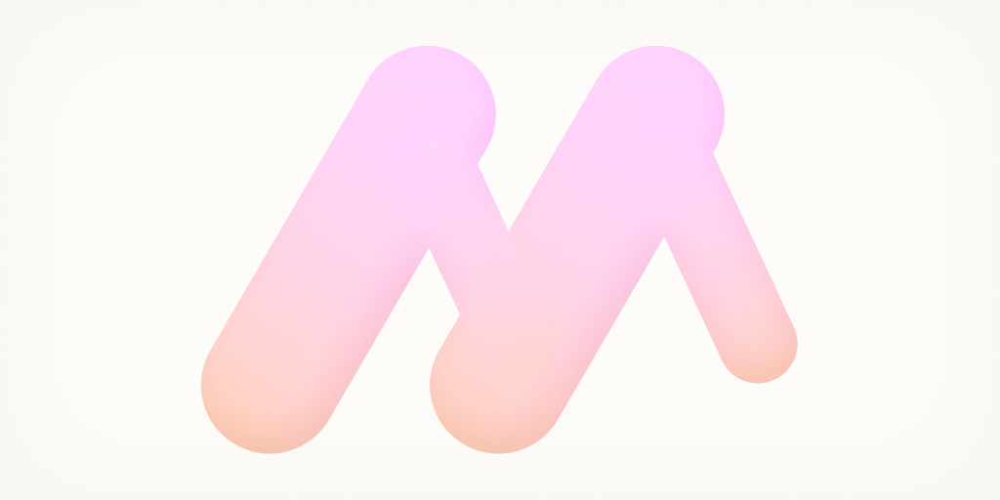

# moony

A simple server for your game. Can be used with any engine. Has a client example for Godot.



*moony logotype*

---

> Disclaimer: This project is developed on macOS and tested on macOS. All instructions are for that system only, although the project and commands may work on any other system. Support will be improved later.

> If you want to help me or see me doing something wrong in terms of Go (or anything else), please contact me or create a PR, I'd appreciate it, thanks! P.S. I'm new to Go lang.

--- 

### Requirements

1. Install Go 1.23
2. Install reflex (`go install github.com/cespare/reflex@latest`)

> The project will probably work on any other version of Go, but it was originally created in version 1.23

---

### Load shell

1. Open project root in terminal
2. Run command: `source shell.sh`
3. Run `godot:help` to display all commands

> Shell will also update chmod for scripts in scripts folder, you can remove this part if you don't want to

---

### Issues

**Reflex command not found (`zsh: command not found: reflex`)**

* open your terminal and run `ls $HOME/go/bin/reflex` to check if reflex is installed 
* if it is installed run `open ~/.zprofile` or `~/.zshrc` to open your shell configuration 
* your shell config may have different name
* add these lines to your config

```
# go path
export PATH="$PATH:$HOME/go/bin"
```
